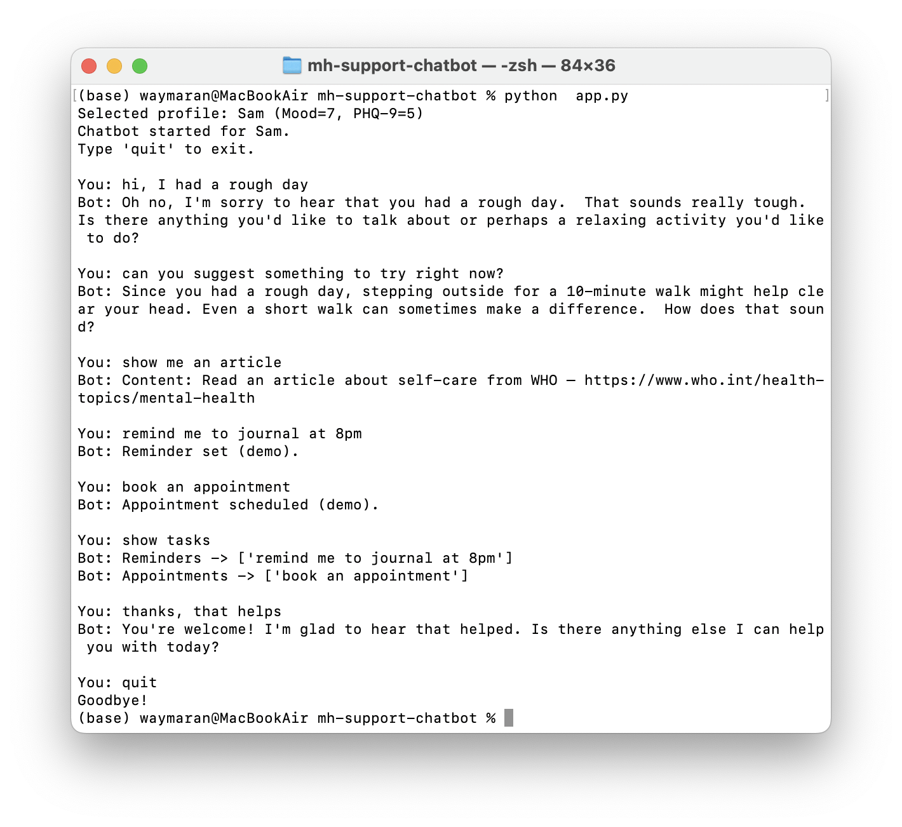
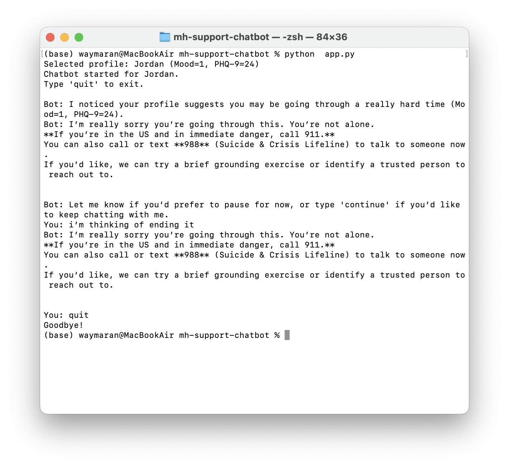

# Mental Health Chatbot (Demo)

A **Gemini**-powered 24/7 wellness companion for support teams.  

## Key Capabilities
- **Appointments (simulated):** “book/schedule an appointment” -> confirms and stores locally  
- **Reminders (simulated):** “remind me …” -> confirms and stores locally  
- **Content help:** “show me an article/resource” -> serves links from `data/activities.json`  
- **Lonely-time activities:** **personalized** suggestions from mock `profiles.json` (mood, PHQ-9, notes)  
- **Public + private data:**  
  - Public: activities/resources in `activities.json`  
  - Private: mock `profiles.json` for personalization  
  - Crisis detection: **local model** (`joblib`) trained on the [Suicide Watch Reddit dataset](https://www.kaggle.com/datasets/nikhileswarkomati/suicide-watch)  
- **Crisis safety:** hybrid keyword + ML gate; shows 988/911 guidance and pauses chat for high-risk cases  

---

## Demo

### Normal Interaction  
Sample run with a balanced profile (Sam, Mood=7, PHQ-9=5).  
The chatbot demonstrates empathy, gives activity suggestions, shares content, sets reminders and appointments, and recalls stored tasks.



### Crisis Interaction  
Sample run with a severe profile (e.g., Mood=1, PHQ-9=24).  
The chatbot detects risk through the profile and user input, triggers the crisis safety layer, and provides 988/911 guidance while pausing normal conversation.



Related project: [Suicide Ideation Detection (ML Classifier)](https://github.com/imwaymaran/suicide-ideation-detection-ml)  

---

## Features
- **Gemini API (1.5-flash)**  
- **Chat history** maintained via `chat = model.start_chat(history=[])`  
- **Personalization** from `profiles.json` (mood score, PHQ-9, notes)  
- **Activity recommendations** from `activities.json` (tag-based filtering: low mood, balanced, growth, etc.)  
- **Intent parsing** (naive keyword matcher) for reminders, appointments, and content requests  
- **Crisis detection**  
  - Keyword matching (`suicide`, `self-harm`, …)  
  - **ML model** (joblib pipeline) trained on Reddit Suicide Watch dataset  
- **Safety layer**: pauses and shows 988/911 info for severe profiles or detected crisis inputs  
- **Lightweight demo**: pure Python CLI

---

## Quickstart
```bash
git clone https://github.com/imwaymaran/mh-support-chatbot.git && cd <repo>
pip install -r requirements.txt
cp .env.example .env    # add your key
# .env -> GEMINI_API_KEY=your_api_key_here
python app.py
```